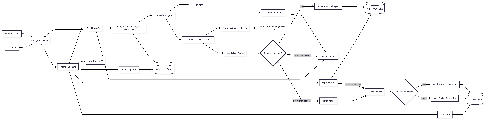
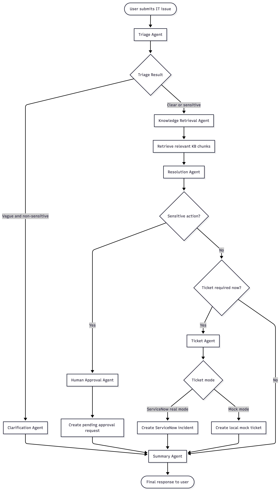
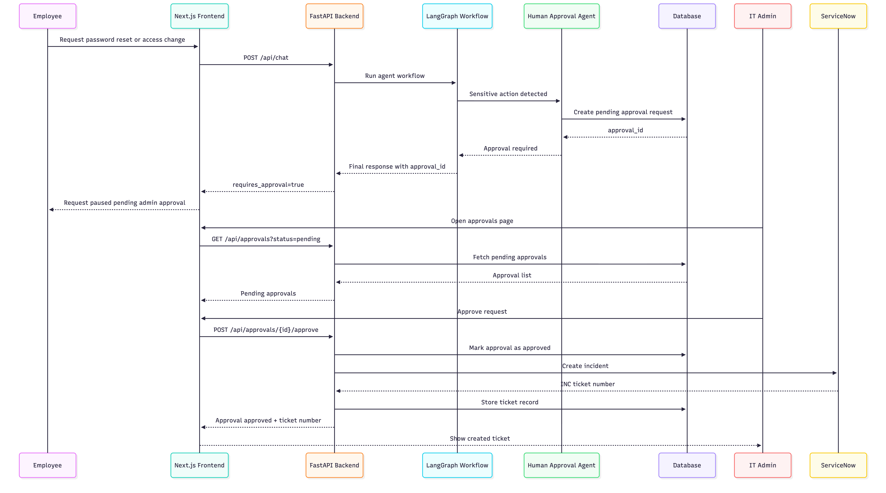
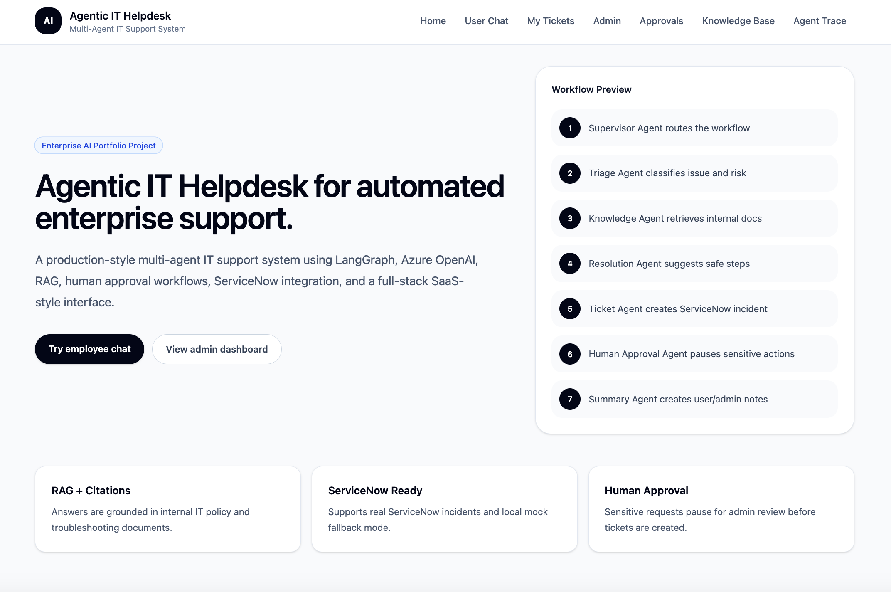
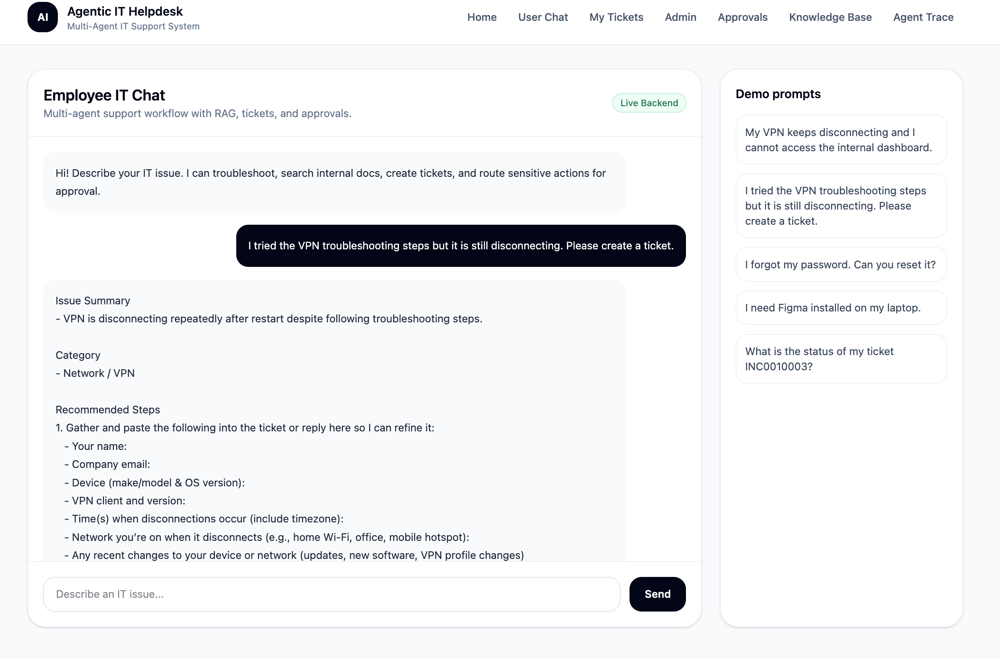
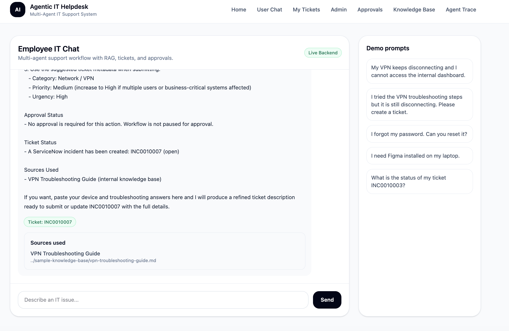
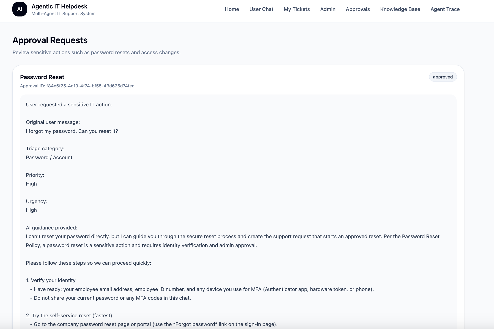
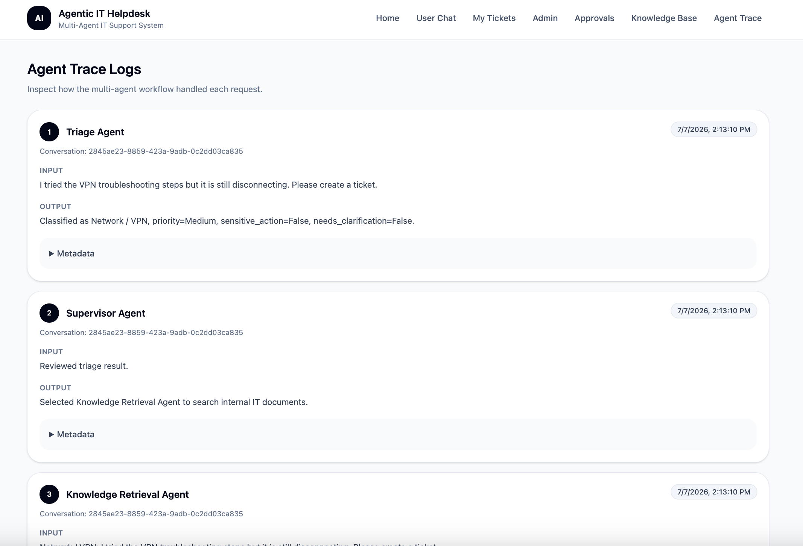
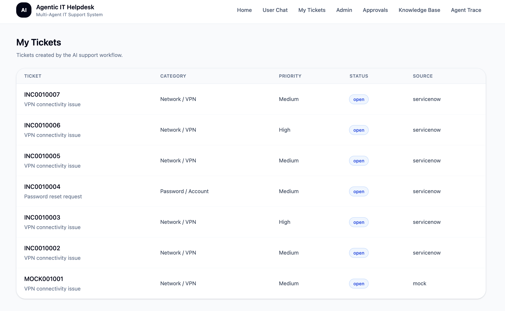

# Agentic IT Helpdesk — Multi-Agent IT Support Automation System

A full-stack, enterprise-style IT support automation platform built with **FastAPI**, **Next.js**, **LangGraph**, **Azure OpenAI**, **RAG**, **ServiceNow**, and **human-in-the-loop approval workflows**.

The system simulates how an enterprise IT helpdesk can use multiple specialised AI agents to triage issues, search internal knowledge base documents, recommend troubleshooting steps, create ServiceNow incidents, and pause sensitive actions for admin approval.

---

## Project Highlights

* Multi-agent workflow using **LangGraph**
* Azure OpenAI-powered IT support assistant
* Retrieval-Augmented Generation over internal IT documents
* Real **ServiceNow Incident API** integration
* Mock ServiceNow fallback for reliable local demos
* Human approval workflow for password resets and access changes
* Full-stack UI with employee and admin views
* Agent trace logging for observability and explainability
* Local database persistence for tickets, approvals, conversations, and logs

---

## Demo Use Cases

### 1. VPN Issue Escalation

User says:

```text
I tried the VPN troubleshooting steps but it is still disconnecting. Please create a ticket.
```

System flow:

```text
Triage Agent → Knowledge Retrieval Agent → Resolution Agent → Ticket Agent → ServiceNow
```

Expected result:

* Issue classified as `Network / VPN`
* Relevant VPN troubleshooting guide retrieved
* ServiceNow incident created
* Ticket number returned, for example `INC0010003`

---

### 2. Password Reset Approval

User says:

```text
I forgot my password. Can you reset it?
```

System flow:

```text
Triage Agent → Knowledge Retrieval Agent → Resolution Agent → Human Approval Agent
```

Expected result:

* Issue classified as `Password / Account`
* Sensitive action detected
* No ticket is created immediately
* Approval request is created
* Admin can approve/reject/request more information

After admin approval:

```text
Approval → Ticket Service → ServiceNow Incident
```

---

### 3. Software Installation Request

User says:

```text
I need Figma installed on my laptop.
```

Expected result:

* Issue classified as `Software Request`
* Software policy retrieved
* Ticket/request created depending on workflow rules

---

## Tech Stack

### Frontend

* Next.js
* TypeScript
* Tailwind CSS
* React Server Components and Client Components

### Backend

* FastAPI
* Python
* SQLAlchemy
* SQLite for local development
* Pydantic
* Uvicorn

### AI and Agents

* Azure OpenAI
* LangGraph
* Multi-agent orchestration
* Structured triage output
* RAG-based answer generation

### Retrieval-Augmented Generation

* ChromaDB
* LangChain document utilities
* Azure OpenAI embeddings
* Markdown-based internal knowledge base

### Ticketing and ITSM

* ServiceNow Personal Developer Instance
* ServiceNow Table API
* Real incident creation
* Mock ticket fallback mode

### Observability and Workflow Data

* Agent trace logs
* Conversation history
* Ticket events
* Approval records

---

## Core Features

### Employee Features

* Chat with AI IT support assistant
* Receive troubleshooting guidance
* Get answers grounded in internal IT documents
* Create support tickets
* View ticket numbers and ticket status
* Trigger approval workflow for sensitive requests

### Admin Features

* View all tickets
* Review approval requests
* Approve, reject, or request more information
* Inspect agent trace logs
* Reindex knowledge base
* Monitor workflow behaviour

---

## Multi-Agent Workflow

The system is designed around specialised agents instead of a single generic chatbot.

| Agent                     | Responsibility                                                             |
| ------------------------- | -------------------------------------------------------------------------- |
| Supervisor Agent          | Routes the workflow between agents                                         |
| Triage Agent              | Classifies issue category, priority, urgency, ticket need, and sensitivity |
| Clarification Agent       | Asks follow-up questions for vague non-sensitive issues                    |
| Knowledge Retrieval Agent | Retrieves relevant internal documents from vector store                    |
| Resolution Agent          | Generates troubleshooting or policy-based response                         |
| Ticket Agent              | Creates mock or real ServiceNow tickets                                    |
| Human Approval Agent      | Creates approval requests for sensitive actions                            |
| Summary Agent             | Produces final user-facing response                                        |
| Logging Layer             | Stores trace steps for observability                                       |

---

## Architecture Overview

The project has three main layers:

```text
Frontend UI
  ↓
FastAPI Backend
  ↓
Multi-Agent Workflow + RAG + ServiceNow + Database
```

The backend coordinates all agent steps and external integrations. The frontend provides employee and admin interfaces.

### Architecture Diagram



### Agent Workflow Diagram



### Human Approval Workflow Diagram



### Data Model Diagram


---

## Project Structure

```text
agentic-it-helpdesk/
├── backend/
│   ├── app/
│   │   ├── agents/
│   │   │   ├── approval.py
│   │   │   ├── clarification.py
│   │   │   ├── graph.py
│   │   │   ├── knowledge.py
│   │   │   ├── resolution.py
│   │   │   ├── state.py
│   │   │   ├── summary.py
│   │   │   ├── supervisor.py
│   │   │   ├── ticket.py
│   │   │   └── triage.py
│   │   ├── api/
│   │   │   ├── routes_approvals.py
│   │   │   ├── routes_chat.py
│   │   │   ├── routes_health.py
│   │   │   ├── routes_knowledge.py
│   │   │   ├── routes_logs.py
│   │   │   └── routes_tickets.py
│   │   ├── core/
│   │   │   ├── config.py
│   │   │   ├── database.py
│   │   │   └── logging_config.py
│   │   ├── models/
│   │   │   └── database_models.py
│   │   ├── schemas/
│   │   └── services/
│   │       ├── approval_service.py
│   │       ├── azure_openai_client.py
│   │       ├── document_ingestion.py
│   │       ├── servicenow_client.py
│   │       ├── ticket_service.py
│   │       └── vector_store.py
│   ├── requirements.txt
│   └── .env.example
│
├── frontend/
│   ├── app/
│   │   ├── admin/
│   │   ├── chat/
│   │   ├── tickets/
│   │   ├── layout.tsx
│   │   └── page.tsx
│   ├── components/
│   ├── lib/
│   ├── types/
│   └── .env.local.example
│
├── sample-knowledge-base/
│   ├── access-request-policy.md
│   ├── laptop-setup-guide.md
│   ├── password-reset-policy.md
│   ├── security-incident-escalation-policy.md
│   ├── software-installation-policy.md
│   ├── outlook-teams-troubleshooting-guide.md
│   └── vpn-troubleshooting-guide.md
│
├── docs/
│   └── images/
│
├── README.md
└── docker-compose.yml
```

---

## Backend API Endpoints

### Health

| Method | Endpoint                 | Description                |
| ------ | ------------------------ | -------------------------- |
| GET    | `/api/health`            | Backend health check       |
| GET    | `/api/chat/azure-health` | Azure OpenAI config health |

### Chat

| Method | Endpoint           | Description                              |
| ------ | ------------------ | ---------------------------------------- |
| POST   | `/api/chat`        | Main multi-agent chat endpoint           |
| POST   | `/api/chat/simple` | Simple direct Azure OpenAI test endpoint |

### Tickets

| Method | Endpoint                                | Description            |
| ------ | --------------------------------------- | ---------------------- |
| GET    | `/api/tickets`                          | List tickets           |
| POST   | `/api/tickets`                          | Create ticket manually |
| GET    | `/api/tickets/{ticket_id}`              | Get ticket details     |
| PATCH  | `/api/tickets/{ticket_id}`              | Update local ticket    |
| GET    | `/api/tickets/status/{ticket_number}`   | Get ticket status      |
| POST   | `/api/tickets/{ticket_number}/comments` | Add comment/work note  |

### Approvals

| Method | Endpoint                                         | Description                       |
| ------ | ------------------------------------------------ | --------------------------------- |
| GET    | `/api/approvals`                                 | List approval requests            |
| GET    | `/api/approvals?status=pending`                  | List pending approval requests    |
| GET    | `/api/approvals/{approval_id}`                   | Get approval details              |
| POST   | `/api/approvals/{approval_id}/approve`           | Approve request and create ticket |
| POST   | `/api/approvals/{approval_id}/reject`            | Reject request                    |
| POST   | `/api/approvals/{approval_id}/request-more-info` | Request more information          |

### Knowledge Base

| Method | Endpoint                       | Description                      |
| ------ | ------------------------------ | -------------------------------- |
| GET    | `/api/knowledge`               | List indexed knowledge documents |
| POST   | `/api/knowledge/reindex`       | Reindex sample knowledge base    |
| DELETE | `/api/knowledge/{document_id}` | Delete knowledge metadata record |

### Agent Logs

| Method | Endpoint                            | Description                       |
| ------ | ----------------------------------- | --------------------------------- |
| GET    | `/api/agent-logs`                   | List agent trace logs             |
| GET    | `/api/agent-logs/{conversation_id}` | Get trace logs for a conversation |

---

## Frontend Pages

| Page               | Description               |
| ------------------ | ------------------------- |
| `/`                | Landing page              |
| `/chat`            | Employee IT support chat  |
| `/tickets`         | User ticket list          |
| `/tickets/[id]`    | Ticket details            |
| `/admin`           | Admin dashboard           |
| `/admin/approvals` | Approval review page      |
| `/admin/knowledge` | Knowledge base management |
| `/admin/logs`      | Agent trace inspection    |

---

## Environment Variables

### Backend `.env`

Create `backend/.env`:

```env
APP_NAME="Agentic IT Helpdesk"
APP_ENV=development
DEBUG=true

DATABASE_URL=sqlite:///./agentic_helpdesk.db

FRONTEND_URL=http://localhost:3000

AZURE_OPENAI_ENDPOINT=https://your-resource.openai.azure.com/
AZURE_OPENAI_API_KEY=your_azure_openai_key
AZURE_OPENAI_API_VERSION=2024-10-21
AZURE_OPENAI_CHAT_DEPLOYMENT=your_chat_deployment
AZURE_OPENAI_EMBEDDING_DEPLOYMENT=your_embedding_deployment

LLM_TEMPERATURE=0.2
LLM_MAX_TOKENS=5000

CHROMA_PERSIST_DIR=./chroma_db
CHROMA_COLLECTION_NAME=helpdesk_kb

SERVICENOW_MODE=mock
SERVICENOW_INSTANCE_URL=
SERVICENOW_USERNAME=
SERVICENOW_PASSWORD=

DEMO_EMPLOYEE_EMAIL=employee@example.com
DEMO_ADMIN_EMAIL=admin@example.com

LOG_LEVEL=INFO
```

For real ServiceNow mode:

```env
SERVICENOW_MODE=real
SERVICENOW_INSTANCE_URL=https://your-instance.service-now.com
SERVICENOW_USERNAME=admin
SERVICENOW_PASSWORD="your_pdi_admin_password"
```

### Frontend `.env.local`

Create `frontend/.env.local`:

```env
NEXT_PUBLIC_API_BASE_URL=http://localhost:8000/api
```

---

## Local Setup

### 1. Clone Repository

```bash
git clone YOUR_REPO_LINK
cd agentic-it-helpdesk
```

---

### 2. Backend Setup

```bash
cd backend
python -m venv .venv
source .venv/bin/activate
pip install -r requirements.txt
```

Create `.env`:

```bash
cp .env.example .env
```

Update Azure OpenAI and ServiceNow values.

Start backend:

```bash
uvicorn app.main:app --reload
```

Backend runs at:

```text
http://localhost:8000
```

Test health:

```bash
curl http://localhost:8000/api/health
```

---

### 3. Reindex Knowledge Base

Run:

```bash
curl -X POST http://localhost:8000/api/knowledge/reindex
```

Expected result:

```json
{
  "status": "success",
  "source_document_count": 7,
  "chunk_count": 20
}
```

---

### 4. Frontend Setup

Open a second terminal:

```bash
cd frontend
npm install
npm run dev
```

Frontend runs at:

```text
http://localhost:3000
```

---

## ServiceNow Setup

This project supports two ticket modes.

### Mock Mode

Mock mode is useful for local development and demos without external dependencies.

```env
SERVICENOW_MODE=mock
```

Generated tickets look like:

```text
MOCK001001
MOCK001002
```

### Real ServiceNow Mode

Real mode creates incidents in a ServiceNow Personal Developer Instance.

```env
SERVICENOW_MODE=real
SERVICENOW_INSTANCE_URL=https://your-instance.service-now.com
SERVICENOW_USERNAME=admin
SERVICENOW_PASSWORD="your_pdi_password"
```

Test ServiceNow API directly:

```bash
curl -i -u "admin:YOUR_PASSWORD" \
  -H "Accept: application/json" \
  "https://YOUR_INSTANCE.service-now.com/api/now/table/incident?sysparm_limit=1"
```

Expected:

```text
HTTP/1.1 200 OK
Content-Type: application/json;charset=UTF-8
```

---

## Example API Tests

### VPN Chat Request

```bash
curl -X POST http://localhost:8000/api/chat \
  -H "Content-Type: application/json" \
  -d '{
    "message": "I tried the VPN troubleshooting steps but it is still disconnecting. Please create a ticket.",
    "user_email": "employee@example.com"
  }'
```

Expected:

```json
{
  "ticket_number": "INC0010003",
  "requires_approval": false,
  "approval_id": null
}
```

---

### Password Reset Approval Request

```bash
curl -X POST http://localhost:8000/api/chat \
  -H "Content-Type: application/json" \
  -d '{
    "message": "I forgot my password. Can you reset it?",
    "user_email": "employee@example.com"
  }'
```

Expected:

```json
{
  "ticket_number": null,
  "requires_approval": true,
  "approval_id": "approval-uuid"
}
```

---

### List Approvals

```bash
curl http://localhost:8000/api/approvals
```

---

### Approve Request

```bash
curl -X POST http://localhost:8000/api/approvals/YOUR_APPROVAL_ID/approve \
  -H "Content-Type: application/json" \
  -d '{
    "admin_comment": "Identity verification completed. Password reset request approved."
  }'
```

Expected:

```json
{
  "status": "approved",
  "ticket_number": "INC0010004"
}
```

---


### Landing Page



### Employee Chat — VPN Ticket Creation




### Human Approval Workflow



### Agent Trace Logs



### ServiceNow Incident



---

## Security and Safety Design

The system intentionally avoids allowing AI to perform sensitive actions directly.

Sensitive actions such as password resets, account unlocks, access changes, and security escalations are routed to a human approval workflow.

The AI can:

* Classify the request
* Retrieve policy information
* Explain the next steps
* Create an approval request
* Create a ticket after approval

The AI cannot:

* Reset passwords directly
* Bypass identity verification
* Grant access without approval
* Disable MFA without human review

---

## Testing

Run backend tests:

```bash
cd backend
pytest
```

Recommended test coverage:

* Triage classification
* Ticket creation in mock mode
* ServiceNow client mapping
* Approval request creation
* Approval rejection
* Knowledge base reindexing
* Agent workflow routing

---

## Troubleshooting

### Backend starts but chat fails

Check:

```bash
curl http://localhost:8000/api/chat/azure-health
```

Make sure Azure OpenAI environment variables are configured correctly.

---

### ServiceNow returns HTML instead of JSON

This usually means the backend is reaching the ServiceNow login page instead of the REST API.

Check:

```env
SERVICENOW_INSTANCE_URL=https://your-instance.service-now.com
SERVICENOW_USERNAME=admin
SERVICENOW_PASSWORD="your_password"
```

Also verify with:

```bash
curl -i -u "admin:YOUR_PASSWORD" \
  -H "Accept: application/json" \
  "https://YOUR_INSTANCE.service-now.com/api/now/table/incident?sysparm_limit=1"
```

---

### Frontend cannot reach backend

Check `frontend/.env.local`:

```env
NEXT_PUBLIC_API_BASE_URL=http://localhost:8000/api
```

Check backend CORS:

```env
FRONTEND_URL=http://localhost:3000
```

Restart both frontend and backend after changing environment variables.

---

### Knowledge retrieval returns no sources

Run:

```bash
curl -X POST http://localhost:8000/api/knowledge/reindex
```

Then retry the chat request.

---

